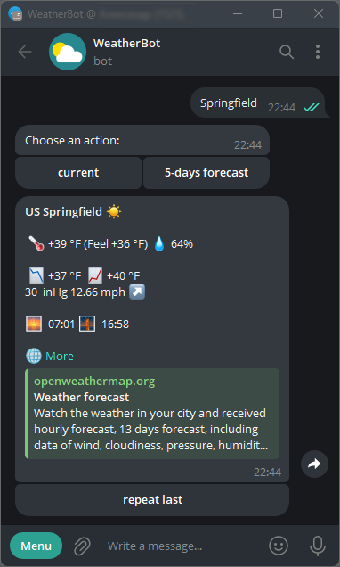
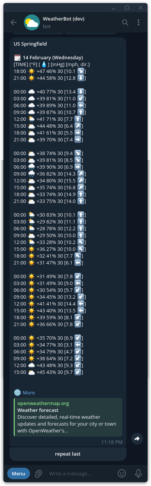
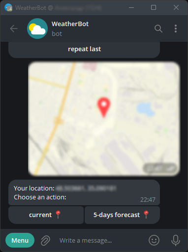

# Simple weather tg bot

Weather Telegram Bot is a Telegram bot written in Golang that provides weather information from the free OpenWeatherMap API. Users can input city names or send their locations to receive current weather details on demand. The bot now utilizes a PostgreSQL database for data storage.

## Table of Contents

- [Screenshots](#Screenshots)
- [Environment Variables](#environment-variables)
- [Installation](#installation)
- [Usage](#usage)
- [Bot Commands](#bot-commands)
- [Pricing Information](#pricing-information)
- [Note](#note)

## Screenshots

Here are some screenshots of the bot in action:

*City name current weather search:*  


*City name 5-days forecast search:*  


*Weather retrieval based on location:*  


## Environment Variables

Before running the bot, make sure to set the following environment variables:


>BOT_DEBUG=(true or false): "Enable/disable debug mode of the Telegram Bot API."  
LOG_LEVEL=(panic/fatal/error/warn/warning/info/debug/trace): "Sets the log level."  
DB_HOST=db: "PostgreSQL database host."  
DB_NAME=postgres: "PostgreSQL database name."  
DB_PORT=5432: "PostgreSQL database port."  
DB_SSLMODE=disable: "PostgreSQL database SSL mode."  
DB_USERNAME=postgres: "PostgreSQL database username."  
TYPE_OF_LOG=(JSONLOG or TEXTLOG): "Choose between JSON or text log format."    
WEATHER_API_URL=https://api.openweathermap.org/data/2.5/: "OpenWeatherMap API URL."

Replace `YOUR_BOT_TOKEN` with your Telegram Bot Token, which you can obtain by creating a new bot on Telegram. Follow these steps:

1. Open Telegram and search for the "BotFather" bot (@BotFather).
2. Start a chat with BotFather and use the `/newbot` command to create a new bot.
3. Follow the instructions from BotFather to choose a name and username for your bot.
4. Once the bot is created, BotFather will provide you with a token.

Get your free OpenWeatherMap API Key [here](https://home.openweathermap.org/api_keys).

Set the values of the LOG_LEVEL and TYPE_OF_LOG variables from the provided options.

In addition, according to the docker-compose.yml file in the secrets folder, the following files contain sensitive information:
- postgres-passwd.txt
- telegram-bot-token.txt
- weather-token.txt

These files are used to set the values of the following variables:
- DB_PASSWORD_FILE
- BOT_TOKEN_FILE
- WEATHER_TOKEN_FILE
- POSTGRES_PASSWORD_FILE

If these variables are not set or empty, the values will be read from the .env and docker-compose.yml (for the database) files without the _FILE suffix in the name.

## Installation

Clone the repository:

```bash
git clone https://github.com/Riznyk01/simple-weather-tg-bot.git
cd simple-weather-tg-bot
```

Build the Docker images:
```bash
make build
```
## Usage
Run the Docker containers:
```bash
make migrate
make run
```

## Bot Commands
/start: sends a welcome message and instructions to the user.  
/help: provides information on how to use the bot.  
/metric: set metric units  
/nonmetric: set non-metric units

## Pricing Information
Information about pricing, available plans, and limitations of the free API package can be found [here](https://openweathermap.org/price).

## Note
Some cities may return weather information correctly using the city name, while others may require the user's location. Use the preferred option for accurate results.

Feel free to contribute and enhance the functionality of this bot!